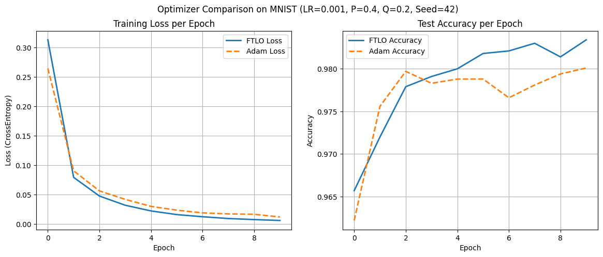
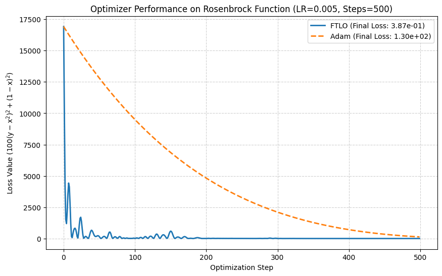
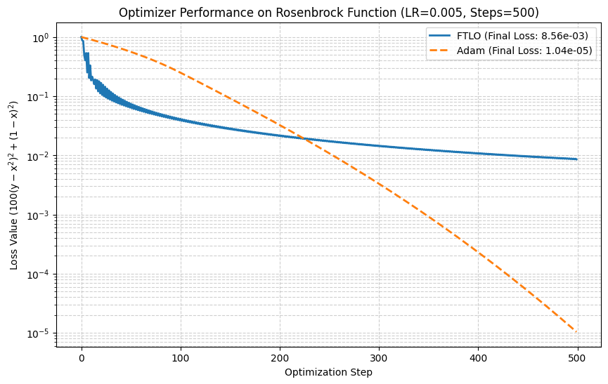

# Fast Trembling Line Optimizer (FTLO)

FTLO is a optimizer for training neural networks

FTLO是一个用于训练神经网络的优化器算法

## Formule | 公式：

### 1. Update of the momentum variable $v$ | 动量变量 $v$ 的更新：

$$
v \leftarrow \beta_2 v + (\beta_2 \cdot \gamma) g
$$

### 2. Update of the parameters $\theta$ | 参数 $\theta$ 的更新：

$$
\theta \leftarrow \theta - \eta g - \alpha v
$$

### 3. Definition of dynamic coefficients | 动态系数定义：

Here, the coefficients $\alpha$ and $\gamma$ decay with the time step $t$ (starting from 1):

其中，系数 $\alpha$ 和 $\gamma$ 随时间步 $t$（从 $1$ 开始）进行衰减：

* **Momentum coefficient $\alpha$** | **动量系数 $\alpha$**：

$$
\alpha = \frac{\beta_1}{\eta \cdot (t+1)^P}
$$

* **Learning rate $\gamma$ for $v$ update** | **$v$ 更新学习率 $\gamma$**：

$$
\gamma = \frac{\eta}{(t+1)^Q}
$$

$g \text{ is the gradient, and } t \text{ is the current time step.}$

$g \text{ 为梯度，} t \text{ 为当前时间步。}$

## ⚙️ Hyperparameter Settings | 超参数设置

We identified a parameter combination that outperforms Adam through comparative experiments with fixed random seeds on the MNIST task

我们在 MNIST 任务上，通过固定随机种子对比实验，找到了超越 Adam 的参数组合

| Parameter/参数 | Symbol/符号 | Description/描述 | Value/数值 |
| :--- | :--- | :--- | :--- |
| Initial Learning Rate | $\eta$ | - | $1 \times 10^{-3}$ |
| 初始学习率 | $\eta$ | - | $1 \times 10^{-3}$ |
| Momentum Coefficient 1 | $\beta_1$ | Baseline affecting $\alpha$ | $0.8$ |
| 动量系数 1 | $\beta_1$ | 影响 $\alpha$ 的基准 | $0.8$ |
| $v$ Decay Factor | $\beta_2$ | History retention rate for $v$ | $0.98$ |
| $v$ 衰减系数 | $\beta_2$ | $v$ 的历史保留率 | $0.98$ |
| Momentum Decay Exponent | $P$ | Decay speed for $\alpha$ | $0.4$ |
| 动量衰减指数 | $P$ | 衰减速度（ $\alpha$ ） | $0.4$ |
| $v$ Decay Exponent | $Q$ | Decay speed for $\gamma$ | $0.2$ |
| $v$ 衰减指数 | $Q$ | 衰减速度（ $\gamma$ ） | $0.2$ |

## 📝 Tuning Strategy and Robustness Observations | 调优策略与鲁棒性观察

The FTLO performs well in tasks **far from the optimal solution** or those that are **high-dimensional and complex** (such as MNIST). However, when the initial point is **very close to the optimum** (for example, starting at $(0, 0)$ for the Rosenbrock function), its momentum term may cause severe oscillations.

FTLO在**远离最优解**或**高维、复杂**任务（如 MNIST）中表现出色。然而，当初始点**非常接近最优解**（例如 Rosenbrock 函数的 $(0, 0)$ 起点）时，其动量项可能导致剧烈振荡。

**Adjusting the decay parameters according to the initial conditions is key to using FTLO:**

**根据初始条件调整衰减参数，是使用 FTLO 的关键：**

| Scenario/场景 | Initial Conditions/初始条件 | Tuning Suggestion/调参建议 | Purpose/目的 |
| :--- | :--- | :--- | :--- |
| **High-Dim / Exploration** | Starting point far from target | Keep $P$, $Q$ small; $B_1$, $B_2$ moderate | Traverse flat regions quickly |
| **高维/探索** | 初始点远离目标 | 保持 $P, Q$ 较小; $B_1, B_2$ 适中 | 快速穿梭平坦区域 |
| **Fine-Tuning / Stabilization** | Starting point close to target | **Lower $B_1$, $B_2$**; **Increase $P$, $Q$** | Weaken momentum influence, accelerate into stable convergence |
| **微调/稳定** | 初始点接近目标 | **调低 $B_1, B_2$**; **调高 $P, Q$** | 削弱动量影响，加速进入稳定收敛 |

## ⚠️ Robustness Recommendation: Gradient Clipping | 鲁棒性建议：梯度裁剪

Since the momentum term $\alpha v$ and the $v$ update learning rate $\gamma$ in the FTLO may lead to aggressive update steps during the early stages of training, we **strongly recommend** applying gradient clipping before optimizer.step() to ensure numerical stability across various tasks (especially those prone to gradient explosion).

由于FTLO的动量项 $\alpha v$ 和 $v$ 更新学习率 $\gamma$ 在训练初期可能导致激进的更新步骤，为了确保在各种任务（尤其具有梯度爆炸风险的任务）上的数值稳定性，我们**强烈建议**在 `optimizer.step()` 之前应用梯度裁剪

**In our MNIST experiments, we used CLIP_NORM = 1.0**

**在 MNIST 实验中，我们使用了 CLIP_NORM = 1.0**

## 🏞 Pictures | 图像

